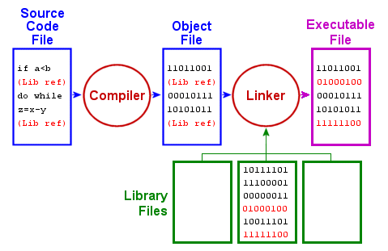

# 2.1 Basic Syntax

```c
#include <stdio.h>
#include <stdlib.h>
#include <string.h>
#include <ctype.h>

/* Compile this program with:
   cc -std=c11 -Wall -Werror -o rotate rotate.c
 */

#define ROT 13

static char rotate(char c)
{
    c = c + ROT;
    return c;
}

int main(int argcount, char *argvalue[])
{
    // check the number of arguments
    if(argcount != 2) {
        exit(EXIT_FAILURE);
    }
    else {
        exit(EXIT_SUCCESS);
    }
    return 0;
}
```

## Comments

```c
/* block comments */
// comments to the end of a line
```

## `#define`

声明变量，当 C 编译器遇到后会在代码中用该常量或宏的值替换每次出现的地方。

## `#include`

包含外部文件。`#include <stdio.h>` 包含了标准输入输出库。在实际编译之前，C 预处理器会处理这些指令。之后被修改后的代码将由编译器进行编译。

## Compiler

`.c` 文件由编译器处理。编译器首先对代码进行预处理，处理如 `#include` 和 `#define` 等指令。然后，它会进行实际的编译过程，这包括语法分析、语义分析、生成中间代码、优化以及最终生成机器代码。编译后生成 Object File, 通常这是一种二进制文件，包含了从源代码编译过来的机器指令，但这些指令尚未链接成可执行程序。

2. 链接（Linker）：

链接器负责将一个或多个目标文件与库文件（Library Files）结合起来生成可执行文件（Executable File）。链接过程解决了程序中对库函数以及程序中其他文件的函数和变量的引用问题。如果你的程序调用了任何库函数（比如标准输入输出库函数），链接器会查找这些函数在库文件中的定义，并将对应的代码链接到你的程序中以确保程序完整性。

3. 库文件（Library Files）：

库文件包含预定义的函数和资源，这些可以被多个程序共同使用。不需要重复编写常用的代码，只需在需要时链接相应的库。



## Variables

### RAM

- single integer value - 4 bytes
- single floating value - 8 bytes

### NAME

字母或下划线开头，后接 _A-Za-z0-9

C 语言区别大小写，C 预处理器提供的常量使用大写表示：`MAXLENGTH, AVATAR, BUFSIZ, ROT`

较旧的 C 编译器将变量名称限制为 8 个唯一字符, 如果为旧环境开发可移植代码，请记住这一点

## Data Type

bool, char, int, float 以及 double 为主要基础数据类型

历史上，不同计算机制造商在基本数据类型的内存大小上存在差异，导致不兼容性问题。

C 语言通过不指定数据类型的大小来解决此问题，使得程序在源代码级别具有可移植性。

C 语言唯一要求是数据类型之间的大小关系应为：sizeof(char) ≤ sizeof(short) ≤ sizeof(int) ≤ sizeof(long)。

不同体系结构上的不同 C 编译器可以使用不同大小的整数，导致存储大小的变化。

测试当前架构下数据类型内存大小代码：

```c
#include <stdio.h>

int main(void)
{
    printf("char  %lu\n", sizeof(char));
    printf("short %lu\n", sizeof(short));
    printf("int   %lu\n", sizeof(int));
    printf("long  %lu\n", sizeof(long));
    return 0;
}
```

Macbook Air M2 执行结果如下：

```c
char  1
short 2
int   4
long  8
```

这意味着这台架构的计算机 can only represent the values -2,147,483,648 to 2,147,483,647

这个值的计算公式为 4 bytes = 4 * 8 bits = 32, 2^32 = 4294967296

而为了表达正负数，需要分配一半给正数一半给负数，正数的范围是 0 到 2,147,483,647，负数的范围是 -1 到 -2,147,483,648。

## The scope of variables

C 只有 2 种主要类型的范围：

- global scope

全局作用域（有时称为文件作用域），其中变量在所有函数和语句块之外声明，以及

- block scope in which variables are declared within a function or statement block.

在函数或语句块中声明变量的块作用域

```c
#include <stdio.h>
#include <stdlib.h>
#include <string.h>
#include <ctype.h>

static int count = 0;

int main(int argcount, char *argvalue[])
{
    int nfound = 0;

    // check the number of arguments
    if(argcount != 2) {
        int nerrors = 1;

        ....
        exit(EXIT_FAILURE);
    }
    else {
        int ntimes = 100;

        ....
        exit(EXIT_SUCCESS);
    }
    return 0;
}
```

其中 count 为 global scope, static 防止外部文件访问，nfound，nerrors, ntimes 具有 block scope 

C 语言控制流和其他语言类似

## Conditional execution

```c
if(condition1) {                
  // more statements;
  .....
}
else if(condition2) {
  // more statements;
  .....
}
else {
  // more statements;
  .....
}
```

curly-brackets 非必需但是和 Java 一样为一种书写格式标准

## Boolean values

在 ISO-C99 之前，C 标准没有布尔数据类型, 0 代表 false 1 代表 true

```c
int initialised = 0

if (0 == initialised) {
  // initialisation statements;
  .....
  initialised = 1; // set to true
}
```

而后需要使用 true 和 false constants 的时候需要倒入 `#include <stdbool.h>` 库

## switch statements

```c
#include <stdio.h>

int main() {
    int value = 2;

    // 使用 if..else if..else 结构
    if(value == 1) {
        printf("The value is 1.\n");
    } 
    else if(value == 2) {
        printf("The value is 2.\n");
    } 
    else {
        printf("The value is neither 1 nor 2.\n");
    }

    // 使用 switch 结构
    switch(value) {          
        case 1 :
            printf("The value is 1.\n");
            break;

        case 2 :
            printf("The value is 2.\n");
            break;

        default :
            printf("The value is neither 1 nor 2.\n");
            break;
    }

    return 0;
}
```

- 每个 case 后都必须加上 break 离开 switch control flow，如果忘记添加 break 语句就会自动继续执行下一个 case 分支
- if 和 switch 中的 expression 数据类型必须是整数、字符、布尔值与 enumerated types，但是不能是 real 或 floating
- 如果比较值较多的情况下 switch 为优化代码量简洁的好方案，因为 case 内不用像 if 一样添加 curly brackets

value 要对比的变量，default 可当作 if 语句中的 else

## for - bounded loops

有界循环和 Java 一样语法：

```c
for(int i = 1 ; i <= 10 ; i = i+1) {
// the above introduced a loop-control variable, i
  .....
  printf("loop number %i\n", i);
  .....
// variable i is available down to here
}

for(char ch = 'a' ; ch <= 'z' ; ch = ch+1) {
  .....
  printf("loop using character '%c'\n", ch);
  .....
}
```

三个参数为起始值、停止条件，执行过程算法；变量在 for loop 内部使用完后消失

## while & do while - unbounded loops

```c
#include <stdio.h>

#define NLOOPS 20

int main()
{
    int i = 1;
    int n = 0;

    while (i <= NLOOPS)
    {
        printf("iteration number %d\n", i);
        // 替换此处为实际计算方法
        i = some_calculation_setting_i;
        n++;
    }

    printf("loop was traversed %d times\n", n);

    return 0;
}
```

与 Python 一样 while 的 expression 意思为只要 i <= 20 那就保持 true 如果超过这个边界那就 false 退出循环

```c
#include <stdio.h>

#define NLOOPS 20

int main()
{
    int i = 1;
    int n = 0;

    do
    {
        printf("iteration number %d\n", i);
        // 替换此处为实际计算方法
        i = some_calculation_setting_i;
        n++;
    } while (i <= NLOOPS);

    printf("loop was traversed %d times\n", n);

    return 0;
}
```

开头 while 换成 do 后 curly bracket 之后加上 while expression 为 do while 循环；与 for 不同的是 while 需从外部声明引入变量用于迭代

## Nest loop

```c
#define NROWS 6
#define NCOLS 4

for(int row = 1 ; row <= NROWS ; row = row+1) {      // the 'outer' loop

    for(int col = 1 ; col <= NCOLS ; col = col+1) {  // the 'inner' loop
        printf("(%i,%i)  ", row, col);               // print row and col as if "coordinates"  
    }
    printf("\n");                                    // finish printing on this line
}
```

### define & variables

define 为在执行期间做文本替换，当需要改变行数或列数时，只需修改定义的地方，而不必在整个代码中寻找和修改相应的变量定义；并且通常静态变量在程序运行期间会一直存在内存中

### break & continue

```c
for(int i = 1 ; i <= 10 ; i = i+1) {
    // Read an input character from the keyboard
    .....
    if(input_char == 'Q') { // Should we quit?
        break;
    }
    .....
    .....
}
// Come here after the 'break'.  i is unavailable
```

在用户输入 Q 后整个程序直接退出

```c
for(char ch = 'a' ; ch <= 'z' ; ch = ch+1) {
    if(ch == 'm') { // skip over the character 'm'
        continue;
    }
    .....
    .....
    statements that will never see ch == 'm'
    .....
    .....
}
```

循环中碰到 m 后不做任何操作跳过进入下一个循环

### infinite loops

```c
for( ; ; ) {
    .....
    .....
}
```

```c
#include <stdbool.h>

// clearer - use this mechanism
while( true ) {
    .....
    .....
}
```

## Conclusion

- 相比于 Python, C 语言和 Java 一样不在乎 indent
- C 提供两种浮点数据类型 float 和 double 分别占用 32 与 64 字节

但在 system programming 中为了避免精度麻烦更多只用整数类型： int, short, long, long long
