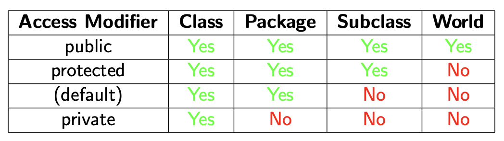

# 7.0 More, Packages

## More inheritance

### abstract

```java
class Animal {
    public void talk() {
        System.out.println("*Generic animal sounds*");
    }
}

class Goose extends Animal {
    public void talk() {
        System.out.println("Honk!");
    }
}
```

Animal 中强行实现的 talk 很奇怪，因此如果不实现就需要用到 `abstract`

#### AbstractAnimal

```java
abstract class Animal {
    public abstract void talk();
}

class Goose extends Animal {
    @Override
    public void talk() {
        System.out.println("Honk!");
    }
}

public class AbstractAnimal {
    public static void main(String[] args) {
        Animal a = new Goose();
        a.talk();
    }
}
```

- 任何类都可以被声明为抽象类
- `new Animal()` leads to an error, 抽象类无法被初始化
- 任何有抽象方法的类都需要被声明为抽象类
- 抽象方法 need no nody
- Abstract methods must be overridden by subclasses
  -  unless the subclass is abstract too

#### Mistakes

```java
abstract class Animal {
    public abstract void talk();
}

class Goose extends Animal {
    // Error: Did not override abstract method talk()
}

public class AbstractError {
    public static void main(String[] args) {
        Animal a = new Animal(); // Error: Cannot instantiate the type Animal
        a.talk();
    }
}
```

以上就是常见错误，子类没有重载，对抽象类进行了初始化

### final

- 有时候我们想要抽象的反义词。
- 抽象方法必须被重写。
- `final` 方法永远不能被重写、继承。
- 注意，一个有 `final` 方法的类不一定是 `final` 类

#### `final` Classes and Methods

```java
abstract class Animal {
    public abstract int numLegs();
}

class Spider extends Animal {
    public final int numLegs() {
        // All spiders have 8 legs
        return 8;
    }
}

class SpiderWith6Legs extends Spider {
    // Error: Cannot override the final method from Spider
    // public int numLegs() {
    // return 6;
    // }
}
```

在类中使用 `final` 方法可以有效防止任何人错误的从你的类中继承

#### `final` variables

```java
public class FinalVariable {
    public static void main(String[] args) {
        final int x = 5;
        // x = 6; // Error: Cannot assign a value to final variable 'x'
        final double y;
        y = 10.5;
        // y = 1.1; // Error: Cannot assign a value to final variable 'y'
        System.out.println(x);
        System.out.println(y);
    }
}
```

作为常量不再可变

```java
public class CircleTools {
    public static final double PI = 3.14159;

    public static double area(double radius) {
        return PI * radius * radius;
    }

    public static double circumference(double radius) {
        return 2 * PI * radius;
    }

    public static void main(String[] args) {
        System.out.println("Area of a circle with radius 5: " + area(5));
        System.out.println("Circumference of a circle with radius 5: " + circumference(5));
    }
}
```

一般来说 `final` 还和 `static` 绑定在一起，目的是防止任何人重新定义半径

### The Object Class

Java 有一个内置的类叫做 Object

*   每个类都继承自 Object（除了 Object 本身）
*   这意味着 Java 中的每个类在技术上都在同一个继承树中
*   Object 有一些方法，这意味着每个类都自带这些方法
*   有时候，你会想要重写这些方法，[我们来看一下](https://docs.oracle.com/en/java/javase/11/docs/api/java.base/java/lang/Object.html)

**今天我们将重点关注 toString() 和 equals()。**

#### `toString()`

- **`.toString()` 方法用于将对象转换为字符串表示形式:** 这个方法的主要工作就是提供一个对象的文本描述。当你需要把一个对象用文字表达出来时，就可以调用它的 `toString()` 方法。
- **这个方法在 Object 类中意味着所有对象都可以表示为字符串:** 因为 `toString()` 是 `Object` 类的方法，而所有类都继承自 `Object`，所以 Java 中的任何对象都具备将自己转换成字符串的能力（即使只是默认的、不太易读的格式）。
- **当我们进行字符串连接 ("a string"+myObject) 时，myObject.toString() 会被调用:** 如果你用 `+` 号把一个字符串和一个对象连接起来，Java 会自动调用那个对象的 `toString()` 方法，得到它的字符串形式，然后再进行连接。
- **对于 System.out.println(myObject) 也是一样:** 当你打印一个对象时，`println` 方法内部也会自动调用该对象的 `toString()` 方法，然后打印返回的那个字符串。
- **重写 .toString() 让我们能够控制我们的对象如何被打印:** 通过在你自己的类里重新实现 `toString()` 方法（即“重写”），你可以自定义当对象需要被表示为字符串时（比如打印或字符串连接时），应该显示成什么样子。这能让输出的信息更有意义、更易于理解。

```java
class MyClass {
    private int x;
    private int y;

    public MyClass(int x, int y) {
        this.x = x;
        this.y = y;
    }

    @Override
    public String toString() {
        return "MyClass(" + x + "}," + y + ")";
    }

    public class ToString {
        public static void main(String[] args) {
            MyClass mc = new MyClass(5, 10);
            System.out.println(mc);
            System.out.println("mc.toString() = " + mc);
        }
    }
}
```

#### `equals()`

就像 `toString()` 一样，所有的 Java 对象都从 `Object` 类那里免费得到了一个基础版的 `.equals()` 方法。但是这个**基础版的 `equals()` 方法，它的行为跟 `==` 一模一样** 它也只是检查是不是内存里同一个对象。这通常不是我们想要的“内容相等”的比较。不像 `String` 类已经精心设计过，它重写了 `equals()` 方法，专门检查两个字符的序列内容是否完全一样。可以可以看到其是如何自定义原本默认函数的：

```java
class StringPair {
    String first, second;

    public StringPair(String first, String second) {
        this.first = first;
        this.second = second;
    }

    @Override
    public boolean equals(Object other) {
        // Make sure that other is a StringPair
        if (other instanceof StringPair) {
            StringPair otherPair = (StringPair) other; // Cast to StringPair
            // Use String .equals() to compare the two Strings
            return first.equals(otherPair.first) && second.equals(otherPair.second);
        }
        return false;
    }
}
```

第九行重写原方法签名

```java
@Override
// 重写父类（Object）的 equals 方法
public boolean equals(Object other) { 
// 接收任何类型的对象 other
```

检查 `other` 这个类属不属于 `StringPair` 类型或是其子类型，不是就返回 `false`

是的话将 `other` 从通用 `Object` 类型强制转换 (cast) 成 `StringPair` 类型

```java
// 把 other 从“任何东西”明确转换成“StringPair”类型
```

然后借用 `String` 类型的 `equals` 函数对比完成任务

```java
public class Equals { 
    // Notice how this will work regardless of which classes are really in the array 
    public static boolean allEqual(Object[] objects) { 
        if (objects.length == 0) { 
            return true; 
        } 
        Object first = objects[0]; 
        for (int i = 1; i < objects.length; i++) { 
            if (!first.equals(objects[i])) { 
                return false; 
            } 
        } 
        return true; 
    } 
    
    public static void main(String[] args) { 
        StringPair[] pairs = new StringPair[3]; 
        pairs[0] = new StringPair("Hello", "World"); 
        pairs[1] = new StringPair("Hello", "World"); 
        pairs[2] = new StringPair("Hello", "World"); 
        
        System.out.println(allEqual(pairs)); 
    } 
}
```

以上创造了一个函数叫 `allEqual` 一样借用 `String` 的相等方法完成任务

### The SDLC and Testing

SDLC 的第五步是 `Testing`

#### Unit Testing

- 单元测试是在软件开发过程中创建的自动测试
- 通常情况下，它们是唯一能让人相信你的代码能正常工作的好方法
- 有时候，人们会遵循一种叫做测试驱动开发的流程
- 首先写测试，然后写代码让这些测试通过
- 虽然软件开发的生命周期听起来可能有点抽象，但单元测试是非常实用的

JUnit 是早期主要的单元测试框架之一，它是为 Java 定制的，功能非常强大。我们可以在面向对象编程中单独测试每个类！针对不同语言有很多这样的框架。学习框架不是这门课程的范畴，尽管你应该知道它们的存在和使用。我们会用我们自己的（简单的）框架来做一个基本的单元测试介绍，并且在过程中会用到抽象和最终类。

##### SimpleUnitTest

```java
public abstract class SimpleUnitTest {
    public static final void assertTrue(boolean condition) {
        // See full code for details
        // Error if condition is false
    }

    public abstract void runAllTests();

    public static final void main(String[] args) {
        // See full code for details
        // Look for a class named arg[0]
        // If it is a subclass of SimpleUnitTest, call runAllTests()
    }
}
```

- `assertTrue()` 和 `main()` 是最终的，因为它们永远不需要被修改。
- `runAllTests()` 是抽象的，因为它必须被重写。

我们来测试一下之前提到的 `Expression` 类：

单独建立一个 `ExpressionTest.java` 

```java
public class ExpressionTest extends SimpleUnitTest {
    void testAddition() {
        assertTrue(new Add(new Value(1), new Value(1)).evaluate() == 2);
        assertTrue(new Add(new Value(1), new Value(2)).evaluate() == 3);
        assertTrue(new Add(new Value(3), new Value(-3)).evaluate() == 0);
    }

    void testMultiplication() {
        assertTrue(new Multiply(new Value(1), new Value(1)).evaluate() == 1);
        assertTrue(new Multiply(new Value(1), new Value(2)).evaluate() == 2);
        assertTrue(new Multiply(new Value(3), new Value(-3)).evaluate() == -9);
    }

    void testMixed() {
        assertTrue(new Add(new Multiply(new Value(1), new Value(1)), new Multiply(new Value(1), new Value(2)))
                .evaluate() == 3);
        assertTrue(new Multiply(new Add(new Value(1), new Value(2)), new Add(new Value(3), new Value(4)))
                .evaluate() == 21);
    }

    @Override
    public void runAllTests() {
        testAddition();
        testMultiplication();
        testMixed();
    }

    // 添加 main 方法以便直接运行
    public static void main(String[] args) {
        ExpressionTest tester = new ExpressionTest();
        tester.runAllTests();
    }
}
```

```shell
javac ExpressionTest.java SimpleUnitTest.java
java ExpressionTest
```

## Packages

要是好多程序员在一块儿搞个大项目，名字撞车是难免的。Java 允许两个类有不同的名字，只要它们在不同的 **namespace** 里就行。用包来解决问题，我们可以把一些相关的类放在一起，弄成包。到现在为止，咱们一直用的就是一个包：默认包。**每个包都是一个新命名空间。** 

- 包基本上就是一个命名空间里的类集合。
- 它封装了一组类。
- 就像是一个元级别的类。

要把一个类放在一个包里，你得做两件事儿：

第一，在 `.java` 文件顶部写上包名 `pkgname;`

第二，把类放在一个和包名一样的文件夹里：`/path/to/project/pkgname/`

```java
package pkga;

public class MyClass {
    public static void main(String[] args) {
        System.out.println("MyClass");
    }
}
```

假设你已经在你想存放项目的目录里：比如，`Lecture13/` 这个目录）

- 我们可以通过 `javac Lecture13/MyClass.java` 来编译 `MyClass`
- 我们可以通过 `java Lecture13.MyClass` 来运行它
- 我们用点来访问包里面的类

如果我们忘了写包名，就会出错了。 一般来说，目录名和包名得对得上

Java 会去对应的目录里找包，如果你的类不在那里，程序就会崩溃了。

如果项目有多层文件夹也可以继续重叠使用：

```java
package pkgb.subpackage1;

public class MyClass {
    public static void main(String[] args) {
        System.out.println("MyClass #2");
    }
}
```

### `import`

实习写代码过程中 Java 自动寻找同目录代码，子目录代码需要 `import`，`import` 别的路径的包也可以使用 `.` 语法

```java
import pkg.subpkg.etc;
```

现在举例：

```shell
Lecture13/
Lecture13/other directories...
Lecture13/vehicles/
Lecture13/vehicles/Bicycle.java
Lecture13/vehicles/Car.java
```

```java
import vehicles.Bicycle;
import vehicles.Car;
```

如果想直接一次性倒入完成：

```java
import vehicles.*
```

有时候可能需要组合：

```java
package pkgc;
import vehicles.*;
```

把代码放到 `pkgc` 目录里并不会改变 `import` 文件

- `import` 后面写的包名是**相对于整个项目环境的“绝对”名称**，**不是**相对于你当前所在的包`pkgc` 的“相对”位置。不能写成 `import ../vehicles.*;`

- `import` 语句告诉 Java 编译器和运行时（JVM）：“我需要用到名为 `vehicles` 的这个包。至于这个名为 `vehicles` 的包**具体在磁盘上的哪个位置**，是由你**启动程序的方式和类路径（Classpath）设置**来决定的。
- 你应该站在你项目的**最顶层目录**来执行 `java` 命令。Java 默认会从你执行 `java` 命令的那个目录开始，根据你提供的“包名.类名”（如 `pkgc.VehicleExample`）来查找对应的 `.class` 文件（查找 `pkgc` 文件夹下的 `VehicleExample.class`），它不会自动往上层目录查找

```shell
.
├── pkgA
│   ├── Provider.class
│   └── Provider.java
└── pkgB
    ├── Consumer.class
    └── Consumer.java
```

```java
package pkgB; // Declares this class belongs to the 'pkgB' package

// Import statement uses the 'absolute' package name 'pkgA'
// It doesn't matter that Consumer.java is in pkgB.
// We are telling Java: "Find the package named 'pkgA' relative to the classpath root".
import pkgA.Provider;

// Trying something like 'import ../pkgA.Provider;' would be a compile-time error.
// Java imports are not relative file paths.

public class Consumer {
    public static void main(String[] args) {
        System.out.println("Consumer starting in pkgB...");
        Provider myProvider = new Provider(); // Create an instance of the imported class
        myProvider.offerService(); // Use the imported class
        System.out.println("Consumer finishing in pkgB.");
    }
}
```

```java
package pkgA; // Declares this class belongs to the 'pkgA' package

public class Provider {
    public void offerService() {
        System.out.println("  -> Service offered by Provider in pkgA!");
    }
}
```

```shell
javac pkgB/Consumer.java
java pkgB/Consumer
```

虽然现代编译器自动完成了这些事

### The Classpath

- 我们运行 `Java` 程序的时候，它会找那些放在子目录里的包
- 每次 `Java` 看到 `import` 语句，它就会从当前目录开始，往对应的子目录里找
- 你还可以告诉 `Java` 去其他地方找包
- 它会检查在 `classpath` 里指定的所有目录
- 你可以修改 `classpath`

#### Java API

默认情况下 `classpath`自动搜索包含当前路径，也会搜索 Java API 

```java
import java.util.Scanner;
```

https://docs.oracle.com/en/java/javase/11/docs/api/java.base/module-summary.html

`java.lang` 包里头有 `String` 和 `Object` 这样的类被默认导入，和默认包里的所有东西一起自动导入。

#### Adding to the Classpath

如果我们想改换类路径，可以用这个 `--class-path` 标志

- 可以用冒号 `:` 分隔来指定多个目录
- `javac --class-path=path/to/package:path/to/other/package`.
- `java --class-path=path/to/package:path/to/other/package`
- 在 Windows 系统里，目录路径要用反斜杠
- 别忘了把当前目录也加上，`--class-path=some/path:.`
- 通常 IDE 会帮你处理这个，你也可以用同样的方法修改 `CLASSPATH` 环境变量

比如为了执行一个依赖两个不同目录的文件

```java
.
├── Lecture13
│   ├── ClasspathExample.java
│   ├── pkga
│   │   ├── MyClass.java
│   │   └── NoPackage.java
│   ├── pkgb
│   │   ├── subpackage1
│   │   │   └── MyClass.java
│   │   └── subpackage2
│   │       └── MyClass.java
│   ├── pkgc
│   │   └── VehicleExample.java
│   ├── VehicleExample.java
│   └── vehicles
│       ├── Bicycle.java
│       ├── Boat.java
│       ├── Car.java
│       ├── extra_vehicles
│       │   └── Kayak.java
│       └── MotorBoat.java
└── Lecture13_Extra
    └── pkgd
        └── Greeter.java
```

```java
javac --class-path=../Lecture13 Extra/:. ClasspathExample.java
java --class-path=../Lecture13 Extra/:. ClasspathExample
```

在 Lecture13 文件夹中，那么这样寻找自己当前目录下子包的同时还涵盖了另外一个文件夹的

另外包可以被编辑为 `.jar` 文件，也就是 Java Archive

https://docs.oracle.com/javase/tutorial/deployment/jar/basicsindex.html

一样可以被添加进 `classpath`

```shell
javac --class-path=path/to/mypackage.jar
```

### Packages and Access Modifiers



任何子类都可以访问受保护的成员，即使这个子类在另一个包里。

如果你想让人家能扩展你的类并且使用里面的成员，就把它设置为受保护的，否则就设置成默认

