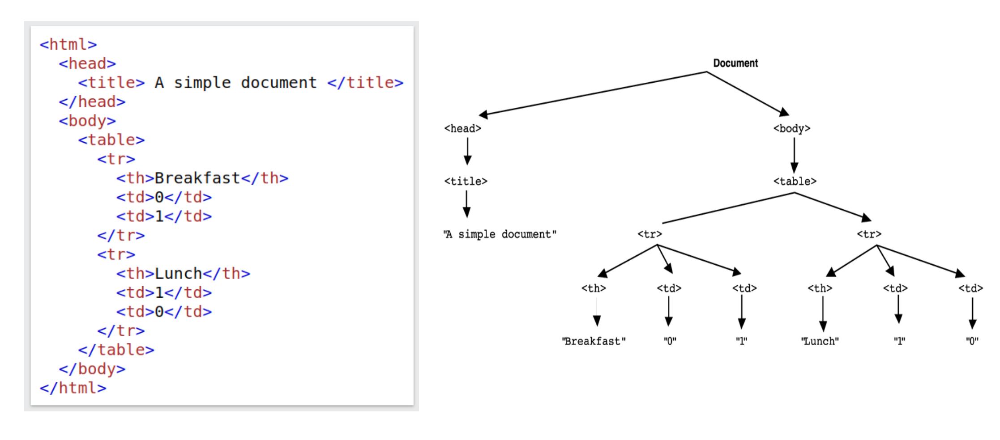
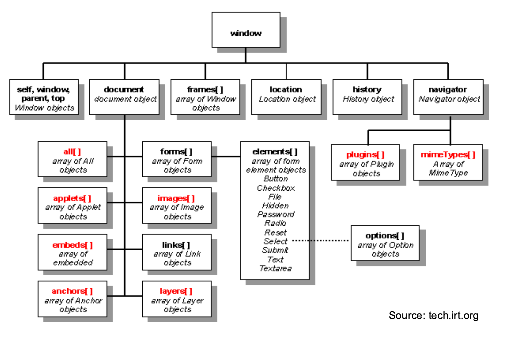

# 6.1 Exam QAs

## Q1 

**What is the primary purpose of the Document Object Model (DOM) in web development?**

To provide a way for scripts to dynamically access and update the content, structure, and style of web documents. This aligns with the DOM's role as an API for HTML documents, allowing programmatic manipulation.

文档对象模型是平台和语言中立的接口，它将允许程序和脚本动态访问和更新文档的内容，结构和样式。可以进一步处理该文档，并且该处理的结果可以回到呈现的页面中。 `getElementsbytagname` 这种， `documents.pet.catNam` 访问，并且通过这些方法在页面加载后改变页面

## Q2

**Which of the following best describes the Browser Object Model (BOM)?**

DOM 是 BOM 的其中一个分支，包含浏览器执行环境等特点

The BOM allows interaction with the browser window and environment, which is distinct from the document's content.

## Q3

**What is a key difference between web storage (like localStorage) and cookies?**

http（s）请求是无状态的，一旦用户将远离网页导航后，服务器和客户端都不会维护信息。

cookie是一个包含键值对的字符串，最大4KB文本文件可通过 document.cookie 访问；cookies指定有效期，或者在关闭浏览器时将删除。

本地存储是一个键值字典，其中值存储为字符串；默认情况下，本地存储仅在客户端可用，储存更多容量 10MB 这样

1. **cookies are automatically sent by the browser with every HTTP request** to the domain that set them.  This allows servers to read information like session IDs or user preferences.
2. Web storage also allows websites to store data in a user's browser. However, unlike cookies, data in localStorage or sessionStorage is not automatically transmitted with every HTTP request.  **It's primarily for client-side storage** and manipulation. If a server needs this information, it must be explicitly sent by the client-side JavaScript code (e.g., as part of an AJAX request).

## Q4

**What is a fundamental characteristic of event-driven programming in the context of web browsers?**

由鼠标点击，键盘按键之类的驱动；代表有 *Ajax, JS Callback*

事件的一个重要用途是验证表单内容，而无需使用带宽和时间访问远程服务器。

The program's flow is primarily determined by the occurrence of events, such as user actions or messages from other programs.

---

## Q5

**According to the lecture, what is generally the recommended modern approach for registering an event handler in JavaScript for better separation of concerns and flexibility?**

用 `addEventlistener()` 函数；

1. `<button onclick="...">`这样的是一种早期方法；关注点无法分离与 HTML 混在一起难以维护阅读

灵活性差，一个事件属性只能 `assign ` 一个函数，添加多个不方便

2. `element.onclick = myFunction;`

将 JS 代码迁移到了 `<script>` 标签：只能指向一个函数，新的会覆盖旧的

---

## Q6

**In the context of DOM event flow, what does "event bubbling" refer to?**

在HTML DOM中，当一个事件（比如点击）发生在一个元素上时，它并不仅仅只影响该元素。事件会经历一个称为“事件流”的过程，事件冒泡描述的是当一个事件在DOM树中的某个元素（目标节点）上被触发后，该事件会接着向上传播，依次触发其所有父元素（祖先节点），一直到文档的根节点。在大多数浏览器中，事件处理的默认行为是在冒泡阶段进行 。

A. The event triggers handlers on sibling elements simultaneously.

这个选项描述的是 `event capturing`

B. The event is first handled by the outermost ancestor (document root) and then propagates down to the target element.

说反了

C. Only the target element that directly received the event can handle it.

不对，有事件捕获和事件冒泡这样的事件流机制，才允许多个元素（目标元素及其祖先元素）响应同一个事件 

D. The event is handled by the target element first, and then propagates up through its ancestors towards the document root.

---

## Q7

**What is the primary purpose of the `load` event in the browser?**

`load` 事件目的是告诉你的 Js 整个页面以及其所有依赖的所有资源都已经全部加载完毕，资源包括：

* CSS
* JS
* images
* iframes

***It fires when the entire page has finished loading, including all dependent resources like images and scripts.***

---

## Q8

**According to the lecture, what was a primary motivation for the development and popularity of jQuery?**

To provide a more concise and easier way to **manipulate the DOM and handle events compared to early verbose native JavaScript.**

可以用 CDN 访问，语法是 `$（selector）.Action（）`

---

## Q9

**The lecture mentions two common data formats frequently used with AJAX requests for exchanging structured data between the client and server. What are these two formats?**

XML 和 JSON

---

## Q10

**Which of the following describes a general capability of JavaScript when interacting with the DOM, without needing to know specific method names?**

JavaScript can add new HTML elements, change existing content, and modify styles after the page has loaded.
