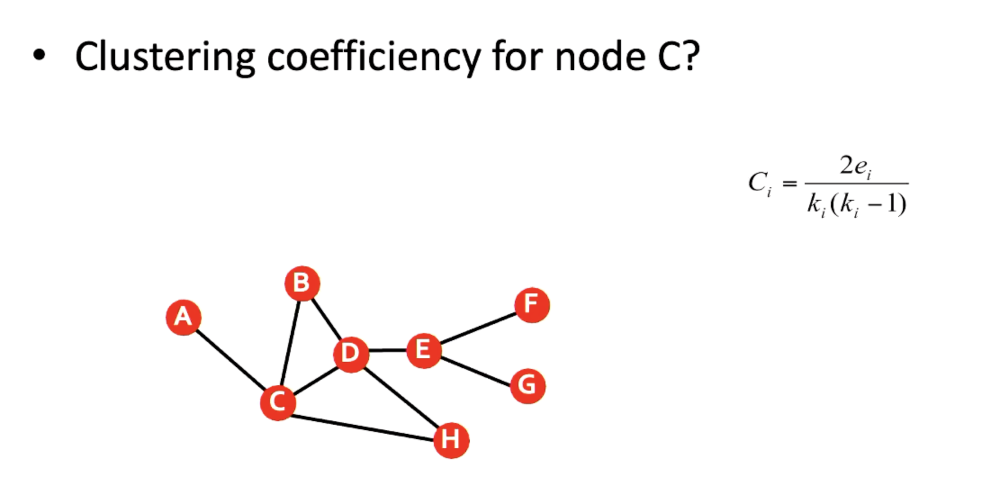

# 10.0 Exam Samples

## 1.0 Hamming Distance and Error Detection/Correction

First, we are given three codewords:

* **C1:** `0101111`
* **C2:** `1010001`
* **C3:** `1100010`

These codewords are used in digital communication to represent information and help detect or correct errors.

---

### a. What is the distance of this code?

**🎯 Goal:** Find the minimum Hamming distance of this code.

1.  **What is Hamming Distance?**
    The Hamming distance between two strings of equal length is the number of positions at which the corresponding symbols are different. Simply put, it's how many bits you need to change to transform one codeword into another.

2.  **Calculate the pairwise Hamming distances:**

    - **d(C1, C2):** `0101111` vs `1010001`
      

```
        C1: 0 1 0 1 1 1 1
        C2: 1 0 1 0 0 0 1
            ↑ ↑ ↑ ↑ ↑ ↑   (differing bits)
        Differing bits: 6  => d(C1, C2) = 6
```

    - **d(C1, C3):** `0101111` vs `1100010`

```
        C1: 0 1 0 1 1 1 1
        C3: 1 1 0 0 0 1 0
            ↑     ↑ ↑   ↑ (differing bits)
        Differing bits: 4  => d(C1, C3) = 4
```

    - **d(C2, C3):** `1010001` vs `1100010`

```
        C2: 1 0 1 0 0 0 1
        C3: 1 1 0 0 0 1 0
              ↑ ↑     ↑ ↑ (differing bits)
        Differing bits: 4  => d(C2, C3) = 4
```

3.  **Distance of the code ($d_{min}$):**
    The distance of the code is the *minimum* Hamming distance among all pairs of codewords.
    In our calculations, the distances are 6, 4, and 4.
    So, $d_{min} = \min(6, 4, 4) = 4$.

    **Answer (i)**: The distance of this code is 4.

---

### b. How many errors can this code detect/correct?

**🎯 Goal:** Calculate the error detection and correction capabilities based on the minimum Hamming distance $d_{min}$.

* We already know $d_{min} = 4$.

1.  **Error Detection Capability ($s$):**
    A code can detect up to $s$ errors, where $s = d_{min} - 1$.
    $s = 4 - 1 = 3$.
    This means the code can **detect up to 3 errors**. If 1, 2, or 3 errors occur, we will definitely know the data is corrupted.

2.  **Error Correction Capability ($t$):**
    A code can correct up to $t$ errors, where $t = \lfloor \frac{d_{min} - 1}{2} \rfloor$. ($\lfloor x \rfloor$ means floor of x, i.e., round down to the nearest integer).
    $t = \lfloor \frac{4 - 1}{2} \rfloor = \lfloor \frac{3}{2} \rfloor = \lfloor 1.5 \rfloor = 1$.
    This means the code can **correct up to 1 error**. If a 1-bit error occurs, we can not only detect it but also change it back to the correct codeword.

    **Answer (ii)**: This code can detect up to 3 errors and correct up to 1 error.

---

### c. You receive this code `0100011` what can you determine?

**🎯 Goal:** Analyze the received code R = `0100011` and determine its status.

1.  **Calculate the Hamming distance between the received code R and all original valid codewords:**
    - **R:** `0100011`
    - **C1:** `0101111`
    - **C2:** `1010001`
    - **C3:** `1100010`

    - **d(R, C1):** `0100011` vs `0101111`
      

```
        R:  0 1 0 0 0 1 1
        C1: 0 1 0 1 1 1 1
                  ↑ ↑     (differing bits)
        Differing bits: 2 => d(R, C1) = 2
```

    - **d(R, C2):** `0100011` vs `1010001`

```
        R:  0 1 0 0 0 1 1
        C2: 1 0 1 0 0 0 1
            ↑ ↑ ↑     ↑   (differing bits)
        Differing bits: 4 => d(R, C2) = 4
```

    - **d(R, C3):** `0100011` vs `1100010`

```
        R:  0 1 0 0 0 1 1
        C3: 1 1 0 0 0 1 0
            ↑             ↑ (differing bits)
        Differing bits: 2 => d(R, C3) = 2
```

2.  **Analyze the results:**
    - The received code R (`0100011`) is **not** any of the original valid codewords (C1, C2, C3).
    - The distance from R to C1 is 2.
    - The distance from R to C2 is 4.
    - The distance from R to C3 is 2.
    We know the error correction capability of this code is $t=1$. This means if the received codeword is at a distance of 1 from a valid codeword, we can correct it to that valid codeword.
    Currently, R is at a distance of 2 from both C1 and C3. This exceeds the 1-bit error correction capability. We cannot definitively correct R to C1 or C3.

    We also know the error detection capability is $s=3$.

    - If the original codeword was C1, then 2 errors occurred (since d(R,C1)=2). Since 2 ≤ 3, this error is detectable.
    - If the original codeword was C3, then 2 errors occurred (since d(R,C3)=2). Since 2 ≤ 3, this error is also detectable.
    - If the original codeword was C2, then 4 errors occurred (since d(R,C2)=4). This is beyond the guaranteed detection capability (3 errors).
    **What you can determine:**

    - The received code `0100011` **contains errors** because it is not one of the valid codewords.
    - The number of errors is at least 2 (the minimum distance to C1 and C3).
    - Since the minimum distance is 2 and the correction capability is 1, this error **cannot be uniquely corrected** (it's equidistant from C1 and C3).
    - Since the number of errors (at least 2) is less than or equal to the detection capability (3), this error **can be detected**.
    
    **Answer (iii)**: I can determine that the received code `0100011` contains errors, there are at least 2 error bits, and this error is detectable but cannot be uniquely corrected.

---

### d. Add a new codeword that you would still maintain the distance.

**🎯 Goal:** Find a new 7-bit codeword C4 such that its Hamming distance to C1, C2, and C3 is at least $d_{min} = 4$.

* **Existing codewords:**
    - C1: `0101111`
    - C2: `1010001`
    - C3: `1100010`
* **Requirement:** For the new codeword C4:
    - d(C4, C1) ≥ 4
    - d(C4, C2) ≥ 4
    - d(C4, C3) ≥ 4

**Attempt to find C4:**

A simple strategy is to try codewords that are structurally very different, such as the all-zeros `0000000` or all-ones `1111111` codeword.

1.  **Try C4 = `0000000` (all-zeros codeword):**
    - d(`0000000`, C1=`0101111`) = 5 (number of '1's in C1). $5 \ge 4$ 👍
    - d(`0000000`, C2=`1010001`) = 4 (number of '1's in C2). $4 \ge 4$ 👍
    - d(`0000000`, C3=`1100010`) = 4 (number of '1's in C3). $4 \ge 4$ 👍
    Excellent! `0000000` satisfies all conditions.

2.  **(Optional) Try C4 = `1111111` (all-ones codeword):**
    - d(`1111111`, C1=`0101111`) = 2 (number of '0's in C1). $2 \not\ge 4$ 👎
        This one doesn't work because its distance to C1 is too small.

So, `0000000` is a valid new codeword.

**Answer (iv)**: A new codeword that can be added is `0000000` . The Hamming distance from this codeword to all existing codewords (C1, C2, C3) is at least 4, thus maintaining the original minimum distance of the code.

## 2.0 Hamming Code

| A | B | R     |
|---|---|-------|
| 0 | 0 | **0** |
| 0 | 1 | **1** |
| 1 | 0 | **1** |
| 1 | 1 | **0** |

**以上为 XOR**

**To construct a Hamming code for the data codeword `1100010` , we'll follow these steps, assuming even parity:**

### a. Determine the Number of Data and Parity Bits

* **Data bits (m):** The given data `1100010` has m=7 bits.
* **Parity bits (p):** We need to find the smallest integer p that satisfies the inequality $2^p ≥ m+p+1$. For m=7:
  + If p=3, $2^3=8$. $m+p+1=7+3+1=11$. Since 8<11, p=3 is not enough.
  + If p=4, $2^4=16$. $m+p+1=7+4+1=12$. Since 16≥12, we need p=4 parity bits.
* **Total bits (n):** The total length of the Hamming codeword will be n=m+p=7+4=11 bits.

### b. Position Parity and Data Bits

The parity bits (P) are placed at positions that are powers of 2. The data bits (D) fill the remaining slots. We'll label the input data bits as $D_1 D_2 D_3 D_4 D_5 D_6 D_7=1100010$

The 11-bit codeword structure is:

| **Position** | **1** | **2** | **3** | **4** | **5** | **6** | **7** | **8** | **9** | **10** | **11** |
| ------------ | ----- | ----- | ----- | ----- | ----- | ----- | ----- | ----- | ----- | ------ | ------ |
| Type         | P1    | P2    | D1    | P4    | D2    | D3    | D4    | P8    | D5    | D6     | D7     |
| Value        | P1    | P2    | **1** | P4    | **1** | **0** | **0** | P8    | **0** | **1**  | **0**  |

### c. Calculate Parity Bits (Even Parity)

Each parity bit checks specific positions in the codeword. For even parity, the parity bit is set to 0 or 1 to make the total number of 1s in the checked positions (including the parity bit itself) even. Equivalently, P=XOR of data bits it checks.

* **P1 (Position 1):** Checks bits 1, 3, 5, 7, 9, 11. Data bits involved: D1, D2, D4, D5, D7 (at positions 3, 5, 7, 9, 11). P1=D1⊕D2⊕D4⊕D5⊕D7=1⊕1⊕0⊕0⊕0=0
* **P2 (Position 2):** Checks bits 2, 3, 6, 7, 10, 11. Data bits involved: D1, D3, D4, D6, D7 (at positions 3, 6, 7, 10, 11). P2=D1⊕D3⊕D4⊕D6⊕D7=1⊕0⊕0⊕1⊕0=0
* **P4 (Position 4):** Checks bits 4, 5, 6, 7. Data bits involved: D2, D3, D4 (at positions 5, 6, 7). P4=D2⊕D3⊕D4=1⊕0⊕0=1
* **P8 (Position 8):** Checks bits 8, 9, 10, 11. Data bits involved: D5, D6, D7 (at positions 9, 10, 11). P8=D5⊕D6⊕D7=0⊕1⊕0=1

| 校验位 (Parity Bit) | 检查的码字位置 (Codeword Positions) |
|---------------------|-------------------------------------|
| **P1**              | 1, 3, 5, 7, 9, 11                   |
| **P2**              | 2, 3, 6, 7, 10, 11                  |
| **P4**              | 4, 5, 6, 7                          |
| **P8**              | 8, 9, 10, 11                        |

### d. Construct the Hamming Codeword

Now, we assemble the parity bits and data bits into the final 11-bit Hamming codeword:

| **Position** | **1** | **2** | **3** | **4** | **5** | **6** | **7** | **8** | **9** | **10** | **11** |
| ------------ | ----- | ----- | ----- | ----- | ----- | ----- | ----- | ----- | ----- | ------ | ------ |
| Type         | P1    | P2    | D1    | P4    | D2    | D3    | D4    | P8    | D5    | D6     | D7     |
| Value        | **0** | **0** | **1** | **1** | **1** | **0** | **0** | **1** | **0** | **1**  | **0**  |

The resulting Hamming codeword for the data `1100010` is **`00111001010`**.

## 3.0 Can wireless be full duplex?

Standard wireless networks, such as those using CSMA/CA, operate on a half-duplex shared medium. Simultaneous transmission and reception on a single channel is considered impossible because a device's strong outgoing signal makes it difficult to detect a much weaker incoming signal. This is a key reason wireless networks use collision avoidance (CSMA/CA) rather than collision detection (CSMA/CD).

Full-duplex wireless communication is possible through two main approaches:

* **Multiple Channels**: It is possible to achieve full-duplex communication by using separate channels for transmitting and receiving
* **Advanced Techniques**: Limited full-duplex communication can be achieved on a single channel using advanced methods like interference cancellation.

## 4.0 What are the benefits of using CSMA/CD over CSMA/CA?

| Benefit of CSMA/CD               | Explanation                                                  |
|----------------------------------|--------------------------------------------------------------|
| **Faster Collision Handling**    | CSMA/CD offers quick collision detection and recovery. It detects collisions *during* transmission and stops immediately, then initiates a random backoff. This is a more direct response compared to the avoidance mechanisms of CSMA/CA. |
| **No Pre-transmission Overhead** | CSMA/CA uses control frames like Request to Send/Clear to Send (RTS/CTS) to *avoid* collisions before transmission begins. CSMA/CD does not have this avoidance overhead, which can make it more efficient in low-contention wired networks. |
| **Direct Detection Mechanism**   | The protocol's strategy is to directly detect a collision *after* it occurs. This is a suitable and efficient approach for wired Ethernet networks where detecting simultaneous transmissions is feasible. |

|          | **CSMA/CD (Collision Detection)**                            | **CSMA/CA (Collision Avoidance)**                            |
|----------|---------------------------------------------------------------|---------------------------------------------------------------|
| **Pros** | **1. Fast Recovery**: It provides "quick collision detection and recovery". It stops transmitting immediately after a collision is detected and then initiates a random backoff period.<br />**2. Lower Overhead**: In low-contention wired environments, it does not require the overhead of avoidance frames like RTS/CTS, which can lead to higher efficiency. | **1. Designed for Wireless**: Its *avoidance* strategy is specifically designed to work in wireless environments where collision detection is difficult.<br />**2. More Reliable in its Environment**: It uses mechanisms like RTS/CTS control frames to prevent collisions before they happen, which is effective for handling issues like the "hidden terminal problem". |
| **Cons** | **1. Not Suitable for Wireless**: Its core mechanism, collision detection, is difficult to implement in wireless environments.<br /> **2. Performance Degrades with High Collisions**: In shared networks (e.g., using hubs with a single collision domain), performance degrades as traffic and the probability of collisions increase. | **1. Higher Overhead**: The mechanisms used to avoid collisions, including backoff timers and RTS/CTS frames, create additional network overhead that reduces overall efficiency.<br />**2. Lower Efficiency**: Due to the overhead from collision avoidance, the actual throughput of wireless networks is often significantly lower than the nominal bandwidth. |

## 5.0 Describe scenarios where subnet masking is not needed.

| Scenario                        | Description                                                  |
|---------------------------------|--------------------------------------------------------------|
| **Classful Networking**         | In a historical classful addressing scheme, a network (Class A, B, or C) is used as a single, large network without further division. The network and host parts are determined by the first few bits of the IP address itself, implying a default mask. |
| **Simple Point-to-Point Links** | When only two hosts are connected directly on a single link, there is no need to divide the network into smaller segments. The primary concern is direct communication between the two endpoints, not managing multiple subnetworks. |
| **Single, Flat LAN**            | For a small, isolated Local Area Network (LAN) where all devices are on one segment, subnetting is unnecessary if there's no requirement to separate traffic for security, performance, or broadcast domain management. The entire address block is treated as one uniform network. |

## 6.0 Explain two different TCP closing scenarios and how they may happen.

| Scenario              | Description                                                  | How It Happens                                               |
| --------------------- | ------------------------------------------------------------ | ------------------------------------------------------------ |
| **Graceful Shutdown** | This is the standard, orderly process for closing a connection. It involves a sequence of FIN (Finish) and ACK (Acknowledge) flags, ensuring both sides of the connection have finished transmitting all their data before the connection is terminated. A typical sequence involves one side sending a FIN, the other acknowledging it, and then sending its own FIN, which is finally acknowledged by the first side. | This is the normal way to close a connection and is initiated by an application that has finished transferring data. An example would be when a web browser has fully loaded all assets from a server. |
| **Abrupt Reset**      | This is an immediate and forceful termination of the connection. It's accomplished by one side sending a TCP segment with the **RST (Reset)** flag set. The side that receives the RST packet immediately closes the connection without any further negotiation. | This can happen if a host receives a SYN packet for a connection that it doesn't expect or is not working correctly. It can also be triggered by a system timeout, such as when a physical connection is disrupted (e.g., a cable is pulled out), preventing the graceful FIN/ACK sequence from completing. |

## 7.0 Clustering coefficient for node C?



集聚系数是用来衡量一个节点的邻居节点之间有多么“抱团”（即相互连接）的程度。

------

集聚系数是用来衡量一个节点的邻居节点之间有多么“抱团”（即相互连接）的程度。

首先，我们来看一下题目给出的公式：

$$C_i = \frac{2e_i}{k_i(k_i - 1)}$$

* **$C_i$**: 我们要计算的节点（这里是节点C）的集聚系数。
* **$k_i$**: 该节点的**度 (degree)**，也就是它有多少个直接相连的**邻居节点**。
* **$e_i$**: 在该节点的**邻居节点之间**，实际存在多少条边（连接）。

### a. 找出节点C的邻居，并计算其“度” 

$$k_C$$

我们先看看图中有哪些节点是直接与节点C相连的：

* 节点 **A**  
* 节点 **B**  
* 节点 **D**  
* 节点 **H**

节点C一共有 **4** 个邻居。所以，节点C的"度" **$k_C = 4$**。

### b. 找出节点C的邻居之间有多少条连接 ($e_C$)

这一步是关键。我们需要在C的邻居集合 **{A, B, D, H}** 中，寻找它们相互之间的连接。

* A 和 B 之间有连接吗？ **没有**。
* A 和 D 之间有连接吗？ **没有**。
* A 和 H 之间有连接吗？ **没有**。
* B 和 D 之间有连接吗？ **有**。
* B 和 H 之间有连接吗？ **没有**。
* D 和 H 之间有连接吗？ **有**。

检查完毕，在C的4个邻居之间，总共有 **2** 条连接（B-D 和 D-H）。所以，邻居之间的连接数 

**$e_C = 2$**。

### c. 代入公式计算

现在我们已经得到了所有需要的值：

* $k_C = 4$

* $e_C = 2$

我们将这些值代入公式：

$C_C = \frac{2 \times e_C}{k_C(k_C - 1)}$

$C_C = \frac{2 \times 2}{4(4 - 1)}$

$C_C = \frac{4}{4(3)}$

$C_C = \frac{4}{12}$

$C_C = \frac{1}{3}$

所以，**节点C的集聚系数是 1/3** （约等于 0.333）。
