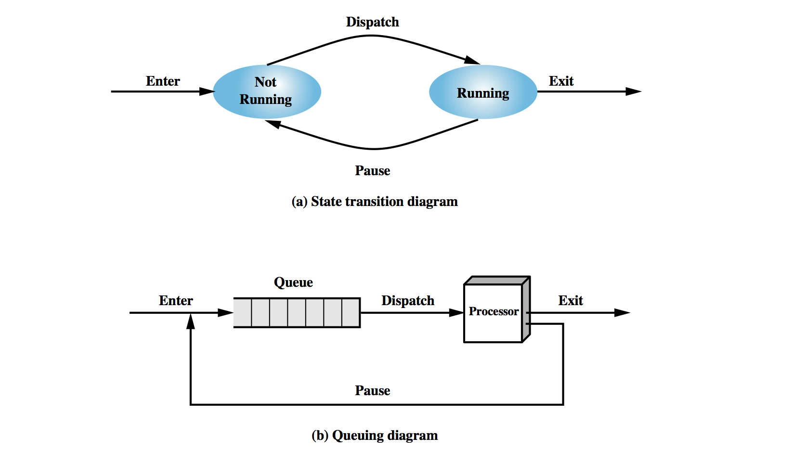
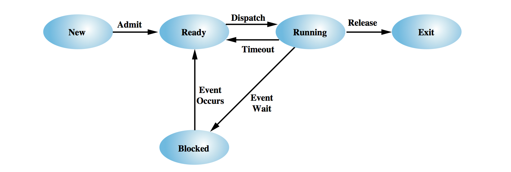

# 5.1 Processes

## Mon Lecture

进度目前刚刚到 Lecture 8 比较赶，midterm 甚至涵盖 Lecture 9

变量储存在内存中，内存位置可能会发生变化，操作系统会对其位置进行记忆

上下文切换（Context Switch）是操作系统在多任务环境中管理多个进程或线程的关键操作。它指的是操作系统在不同的进程或线程之间切换时所需的过程。这个过程涉及保存当前进程的状态和加载下一个进程的状态。上下文切换是多任务操作系统实现并发的基础。

## States

计算机可能有五六百个进程，将这些进程放进 arrary 结构的上下文管理，link list 上下连接，查看启动停止，

two possible process states that a process may be in at any one time: **Running** and **Ready**.

**分页机制**：

- **分页（Paging）** 是一种内存管理方案，将进程的虚拟地址空间划分为页面，将物理内存划分为相同大小的页框。

- 当进程需要访问内存时，操作系统会将虚拟地址转换为物理地址。这个过程涉及页表，页表记录了虚拟页面与物理页框之间的映射关系。

## Transition

操作系统具有*调度员*的角色 - 根据某些定义的策略为处理器分派工作 解决公平性、优先级、明显的“互动性”等问题。

fork parent child

## Termination

`ulimate -a` 能够设置程序运行时间和占用内存等参数

时钟是否正在运行，会对检查

避免进程闲置，在运行别的进程的 IO 阻塞的时候执行的别的东西 blocking 

dispatch 是派遣的意思 admit 认领

**The 5-State Model of Process Execution** 是操作系统中用于管理进程状态转换的经典模型。它定义了进程在执行期间可能处于的五种状态，以及它们之间的转换关系。以下是这五个状态及其解释：

### 1. **New（新建）**

- **描述**：
  - 当一个进程刚被创建时，它处于 **New** 状态。此时，操作系统已经分配了必要的资源，并为进程建立了相关的数据结构，但进程还没有准备好运行。
- **转换条件**：
  - 当操作系统完成对新进程的初始化后，它会进入 **Ready** 状态，准备被调度器调度。

### 2. **Ready（就绪）**

- **描述**：
  - 处于 **Ready** 状态的进程已经分配了所需的资源，并且准备好运行。它正在等待 CPU 资源。
- **转换条件**：
  - 当调度器决定将 CPU 分配给该进程时，它会从 **Ready** 状态转移到 **Running** 状态。

### 3. **Running（运行）**

- **描述**：
  - 进程被分配到 CPU 并正在执行时，处于 **Running** 状态。此时，进程实际占用 CPU 并执行指令。
- **转换条件**：
  - 进程可能从 **Running** 状态转移到以下几种状态：
    - **Blocked**：如果进程需要等待某种资源（如 I/O 操作），它会进入 **Blocked** 状态。
    - **Ready**：如果进程时间片用完，但还没有完成，它会回到 **Ready** 状态，等待下一次调度。
    - **Terminated**：如果进程执行完成或被强制终止，它会进入 **Terminated** 状态。

### 4. **Blocked（阻塞）**

- **描述**：
  - 当进程等待某个事件（如 I/O 完成、获取资源等）时，它进入 **Blocked** 状态。在这个状态下，进程不能运行，甚至不能被调度，直到事件发生。
- **转换条件**：
  - 一旦等待的事件发生，进程会从 **Blocked** 状态转移到 **Ready** 状态，等待 CPU 分配。

### 5. **Terminated（终止）**

- **描述**：
  - 当进程完成执行或被操作系统终止时，它进入 **Terminated** 状态。此时进程的执行结束，所有的资源都将被释放。
- **转换条件**：
  - 在进程终止之后，操作系统会清理进程所使用的资源，包括内存、文件描述符等。

---

### 状态转换图

以下是进程在不同状态之间转换的主要方式：

- **New → Ready**：进程初始化完成，准备执行。
- **Ready → Running**：调度器选择进程并分配 CPU。
- **Running → Blocked**：进程等待某个事件（如 I/O 操作）。
- **Blocked → Ready**：事件发生（如 I/O 完成），进程准备再次执行。
- **Running → Ready**：时间片用完，进程等待下一次调度。
- **Running → Terminated**：进程执行完成或被终止。

---

The 5-State Model 描述了进程从创建到终止的整个生命周期中可能经历的五种状态。这五种状态使操作系统能够有效地调度和管理多个进程，确保资源的合理利用和进程的并发执行。
