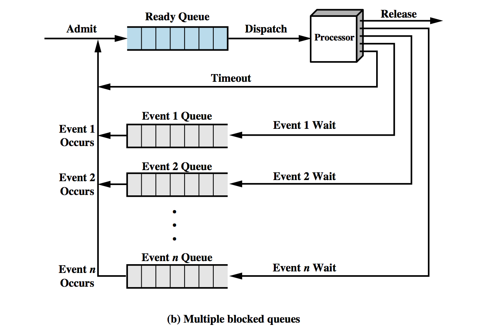

# 5.2 Multiple Blocked States

## Wed Lecture



多阻塞队列模型，避免一个任务在 CPU 或 I/O 等阻塞后拖慢进度

该图展示了操作系统中的 **Multiple Blocked Queues（多阻塞队列）** 模型。在这个模型中，进程可以因不同事件而进入阻塞状态，并且每个阻塞状态对应一个事件队列。这有助于操作系统更高效地管理进程的调度。

### 图中关键部分的解释：

1. **Ready Queue（就绪队列）**：
   - 所有准备好执行的进程都被放在 **Ready Queue** 中，等待调度器分配 CPU。当操作系统将 CPU 资源分配给一个进程时，进程从 **Ready Queue** 中调度（Dispatch）并开始在处理器上运行。

2. **Processor（处理器）**：
   - 处理器执行从就绪队列中调度的进程。当一个进程正在运行时，它会使用 CPU 进行计算和执行指令。

3. **Timeout（超时）**：
   - 如果分配给进程的时间片（CPU 时间）用完了，进程将返回 **Ready Queue**，等待下一个调度周期。

4. **Event n Wait（等待事件 n）**：
   - 如果运行中的进程需要等待某个外部事件（如 I/O 操作完成），它将从处理器中被移除，并进入相应的 **Event Queue**（事件队列）中，进入 **Blocked** 状态。这个模型使用多个阻塞队列，代表进程可以因不同的事件（如多个 I/O 操作）进入不同的阻塞队列。

5. **Event n Queue（事件 n 阻塞队列）**：
   - 对于每个需要等待的事件（如 I/O 完成、信号等），都有一个单独的队列。被阻塞的进程进入相应的事件队列，等待事件发生。

6. **Event n Occurs（事件 n 发生）**：
   - 当某个事件发生时（例如 I/O 操作完成），相应的事件队列中的进程会被移出并放回 **Ready Queue**，准备再次被调度执行。

7. **Release（释放）**：
   - 当进程完成所有任务时，它会从处理器中被释放，操作系统结束该进程的执行。

---

**Multiple Blocked Queues** 模型允许操作系统根据不同事件将进程放入不同的阻塞队列，等待相应事件的完成。这样可以更有效地管理多个进程，并提高系统的并发处理能力。

阻塞进程启用虚拟内存调用存入 disk 中，这样就可以提供更多内存支持其他任务，当没有其他任务的时候从中取出再继续执行，取出之前称之为 Suspend 状态

系统调用 fork system call:

子进程是父进程的完全 copy 历史中叫克隆过程 fork 

### Creating a new process using *fork()*

```c
#include  <stdio.h>
#include  <unistd.h>

void function(void)
{
    int  pid;                 // some systems define a pid_t

    switch (pid = fork()) {
    case -1 :
        printf("fork() failed\n");     // process creation failed
        exit(EXIT_FAILURE);
        break;

    case 0:                   // new child process
        printf("c:  value of pid=%i\n", pid);
        printf("c:  child's pid=%i\n", getpid());
        printf("c:  child's parent pid=%i\n", getppid());
        break;

    default:                  // original parent process
        sleep(1);
        printf("p:  value of pid=%i\n", pid);
        printf("p:  parent's pid=%i\n", getpid());
        printf("p:  parent's parent pid=%i\n", getppid());
        break;
    }
    fflush(stdout);
}
```

fork() 是 UNIX 系统中的一个系统调用，用于创建一个新进程。它会复制当前进程（称为“父进程”），并生成一个几乎完全相同的新进程（称为“子进程”）。新进程的代码和数据段与父进程一致，但它们是独立运行的。

fork() 调用的返回值：

- 在父进程中，fork() 返回子进程的进程 ID (PID)。
- 在子进程中，fork() 返回 0。
- 如果 fork() 调用失败，则返回 -1。

父进程和子进程都会有一个独立的 pid。

fork() 调用会尝试创建一个子进程。如果 fork() 失败（返回 -1），程序会打印 “fork() failed” 并终止。

如果 fork() 在子进程中返回 0，进入 case 0。这个块打印子进程的信息，包括 pid、getpid() 和 getppid()，分别是子进程自己的进程 ID 和父进程的进程 ID。

在父进程中，fork() 返回子进程的 PID，因此会进入 default。父进程会稍微延迟一秒钟（sleep(1)），然后输出自身和子进程的信息。防止父子同时运行导致一些混乱情况。

一旦父进程通过 fork() 创建了子进程，操作系统并没有提供一个专门的系统调用，让父进程能够在之后“查找”或“查询”子进程的 PID（进程 ID）。如果父进程不保存子进程的 PID，它将无法通过特定的系统调用来重新获取子进程的 PID。

如果由于某些原因，父进程丢失了子进程的 PID（例如没有存储 PID），没有特定的系统调用，比如 get_child_pid()，可以让父进程稍后获取它的子进程的 PID。一旦父进程通过 fork() 得到子进程的 PID，就需要父进程自己负责跟踪这个 PID。

父进程在 fork() 之后如何与子进程交互？

- wait() 和 waitpid()：这些系统调用允许父进程等待其子进程结束，并在子进程终止时返回子进程的 PID。

child 也可以 call fork

## Shell

shell 会等待其中所有子进程系统吊影的完成再执行下一步，以下程序仿真了这一点

```c
#include  <stdio.h>
#include  <stdlib.h>
#include  <unistd.h>
#include  <sys/wait.h>

void function(void)
{
    switch ( fork() ) {
    case -1 :
        printf("fork() failed\n"); // process creation failed
        exit(EXIT_FAILURE);
        break;

    case 0:                       // new child process
        printf("child is pid=%i\n", getpid() );

        for(int t=0 ; t<3 ; ++t) {
            printf("  tick\n");
            sleep(1);
        }
        exit(EXIT_SUCCESS);
        break;

    default: {                    // original parent process
        int child, status;

        printf("parent waiting\n");
        child = wait( &status );

        printf("process pid=%i terminated with exit status=%i\n",
                child, WEXITSTATUS(status) );
        exit(EXIT_SUCCESS);
        break;
    }

    }
}
```

## 父子进程内存

当 fork() 创建子进程时，子进程获得了父进程内存的副本，包括程序中的变量、栈（stack）、堆（heap）。父进程使用它原有的内存，而子进程会使用自己拷贝到的内存。换句话说，子进程在开始时有一份与父进程相同的内存副本。

传统观念是父进程调用 fork() 时，操作系统会为子进程创建一份父进程内存的完整副本。然而，这样做效率非常低，因为大部分时候，子进程可能并不会对大部分内存进行修改。

为了优化，现代操作系统引入了 写时复制 (Copy-on-Write, COW) 的机制。这种机制下，操作系统不会立即为子进程复制父进程的所有内存，只有在真正需要的时候才会执行复制。它的工作方式如下：

写时复制的机制优化了内存管理：父子进程只在需要修改数据时，才会真正复制内存。这减少了内存占用，提升了效率。

## shell 加速

在 Unix/Linux 中，父进程使用 fork() 创建了一个新的子进程后，父进程和子进程默认运行相同的代码。但实际需求中，我们希望父进程和子进程执行不同的程序，因此需要一种方法让子进程加载并运行一个新的程序，而不是继续运行父进程的代码。这个时候，execv() 系统调用就派上用场了。

在 Unix/Linux 中，父进程使用 fork() 创建了一个新的子进程后，父进程和子进程默认运行相同的代码。但实际需求中，我们希望父进程和子进程执行不同的程序，因此需要一种方法让子进程加载并运行一个新的程序，而不是继续运行父进程的代码。这个时候，execv() 系统调用就派上用场了。

```c
#include <stdio.h>
#include <stdlib.h>
#include <unistd.h>

char *program_arguments[] = {
    "ls",       // 执行的程序名
    "-l",       // 参数1：列出文件详细信息
    "-F",       // 参数2：附加文件类型
    NULL        // 参数必须以 NULL 结束
};

int main() {
    execv("/bin/ls", program_arguments);  // 调用 execv() 运行 ls 命令

    // 如果 execv 成功运行，下面这行代码不会被执行
    perror("execv failed");               // 如果 execv 失败，打印错误信息
    exit(EXIT_FAILURE);
}
```

在这个例子中，子进程会运行 execv()，用新的程序 /bin/ls 替换它的内存。这意味着它将执行 ls -l -F 命令。成功后，当前进程的代码就完全被新的 ls 程序代码替代。

在父进程和子进程的协作中，通常的做法是：

父进程继续执行它自己的任务。

子进程使用 execv() 或其他类似的 exec 系列函数来运行一个新的程序。

父进程可以通过 wait() 等方式等待子进程完成。

## Conclusion

目的：fork() 创建了子进程后，execv() 让子进程可以运行一个全新的程序。
行为：子进程的内存会被新程序替代，因此它变成了一个全新的程序。
重要性：在多任务系统中，父进程和子进程通常不会做同样的事情，所以需要 execv() 这样的机制来运行不同的程序。

以及 shell 配合 c 语言一起运行的时候参数一起工作的方式很重要

./status 0 && ./status 1

./status 1 && ./status 0

./status 0 || ./status 1

./status 1 || ./status 0

- `&&` 运算符在前一个命令成功时执行后一个命令。
- `||` 运算符在前一个命令失败时执行后一个命令。
- 退出状态码 `0` 通常表示成功，非 `0` 表示失败。
